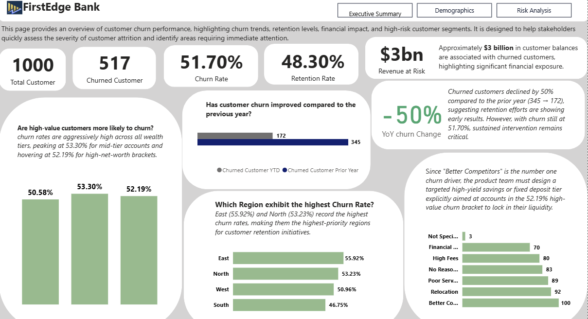
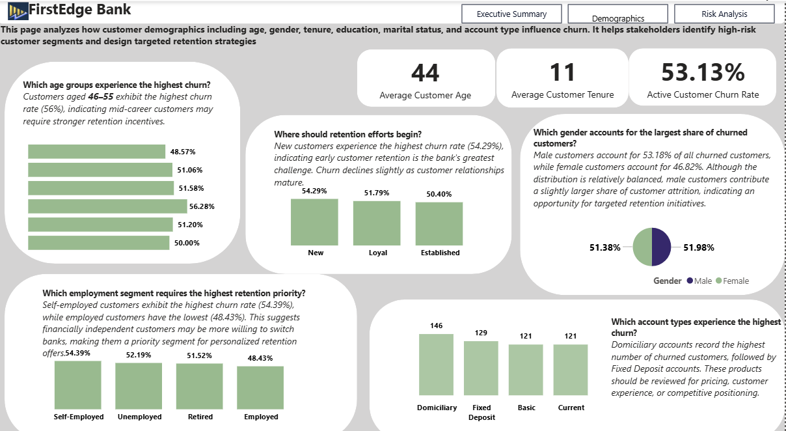

# 🏦 FirstEdge Bank — Customer Churn & Attrition Analysis

An end-to-end Power BI business intelligence solution that analyzes customer churn, financial exposure, and retention risk across a retail banking portfolio. The project transforms customer, financial, and churn datasets into interactive dashboards that help business leaders understand why customers leave and identify data-driven retention strategies.

---

## Table of contents

- [Project Overview](#project-overview)
- [Business Problem](#business-problem)
- [Project Objectives](#project-objectives)
- [Dataset Overview](#dataset-overview)
- [Data Preparation (Power Query)](#data-preparation-power-query)
- [Data Model](#data-model)
- [DAX Measures](#dax-measures)
- [Report Pages](#report-pages)
- [Key Business Insights](#key-business-insights)
- [Recommendations](#recommendations)
- [Conclusion](#conclusion)
- [Tools Used](#tools-used)

---

## Project Overview

FirstEdge Bank is experiencing elevated customer attrition, creating significant financial and operational challenges across its retail banking portfolio. Customer churn not only reduces long-term customer lifetime value but also increases acquisition costs, weakens customer loyalty, and exposes the bank to substantial revenue risk through lost deposits and reduced product utilization. This analysis was conducted to identify the primary drivers of customer attrition, quantify its business impact, and provide actionable recommendations that support data-driven retention strategies
 >**Research Question:** Which customer segments is FirstEdge Bank losing, why are they leaving, and what actions will have the highest impact on retention?

---

##  Business Problem 
FirstEdge Bank is losing customers at a rate it cannot afford to ignore. More than half (51.7%) of its retail customers have either closed their accounts or become inactive, placing approximately ₦3 billion in customer deposits at risk. Customer churn is no longer just a retention issue—it has become a financial and growth challenge.

The bank also lacks clear visibility into who is leaving, why they are leaving, and where the problem is most severe. Churn is highest in the East (55.9%) and North (53.2%) regions, making it difficult to focus retention efforts where they will have the greatest impact. Although churn has fallen by 50% year over year, the overall churn rate remains far above an acceptable level.

The cost of replacing a customer is significantly higher than the cost of retaining one. Every customer who leaves represents lost deposits, reduced opportunities to sell additional products, and additional acquisition costs. The risk is even greater among customers in their first two years, where the bank is losing relationships before they have had time to generate long-term value.

This project was undertaken to answer three business questions:
- Which customers are most likely to churn?
- What factors are driving customer attrition?
-  Where should retention efforts be focused first?

Success will be measured by reducing overall churn to below 35%, lowering churn in the East and North regions, improving retention within the 46–55 age segment, and increasing average product adoption among new customers.

**Problem Classification:** Diagnostic & Strategic

**Primary Business Value:** Revenue Protection & Customer Retention

---

## Project Objectives
The primary objective of this analysis is to provide FirstEdge Bank's executive leadership with actionable insights into the drivers, financial impact, and distribution of customer churn. Specifically, the analysis aims to:
- Quantify the overall level of customer attrition and its impact on revenue exposure. 
- Identify the customer demographics, behaviors, and regions with the highest churn risk. 
- Evaluate the relationship between customer engagement, product ownership, and retention. 
- Determine the primary reasons customers leave the bank and assess their business implications. 
- Provide evidence-based recommendations that support targeted retention strategies and sustainable business growth.

---

## Dataset Overview
The analysis is based on a synthetic retail banking dataset designed to simulate real-world customer churn scenarios.

- **Source:** Synthetically generated using **Mockaroo**.
- **Purpose:** Designed to mirror realistic banking data across customer demographics, financial profiles, and churn behaviour.
- **Records:** 1,000 retail banking customers.
- **Tables:** Three related datasets:
  - `customer_demographics`
  - `account_financial`
  - `churn_status`
- **Analysis Period:** 2022–2024.
- **Data Model:** Star schema with a dedicated Date dimension to support time intelligence and analytical reporting.

> **Note:** The overall churn rate (51.7%) is intentionally elevated beyond typical industry benchmarks (15–25%) to ensure sufficient analytical signal across all customer segments. All findings and methodology apply directionally to a real-world dataset of this structure.

---

## Data Preparation (Power Query)

The source data was cleaned and transformed in Power Query to improve data quality, ensure consistency, and prepare the model for business analysis.

Key data preparation activities included:
- Handling missing values using mean, median, and mode imputation where appropriate.
- Validating and removing duplicate records across all source tables.
- Standardizing date formats and extracting Year and Month from churn dates for time-based analysis.
- Creating business-focused features, including Balance Tier and Tenure Category, to improve customer segmentation.
- Merging customer demographic and financial datasets into a consolidated Dim_Customer table for star schema modeling.
- Applying appropriate data types to support accurate calculations and efficient report performance.

---

## Data Model
The solution is built on a Star Schema to improve model performance, simplify DAX calculations, and support scalable reporting.

- **Fact Table**
  - `churn_status` – Stores customer churn outcomes, complaint records, satisfaction ratings, and churn dates.

- **Dimension Tables**
  - `Dim_Customer` – Consolidated customer demographic and financial information.
  - `Dates` – Calendar table supporting Year → Quarter → Month analysis.

- **Measures Table**
  - `_Metrics` – Contains 18 DAX measures organized into five display folders.
    ### Star Schema
    
 

  ---

## DAX Measures
A total of 18 DAX measures were created and organized into five display folders to improve model organization, readability, and maintainability.

### 1.  Core Metrics

To drive the analytical deep-dive into customer retention, the following core DAX measures were built directly into the data model to ensure dynamic, real-time calculations across all dashboard visuals:

| Measure Name | DAX Formula | Description / Business Logic |
| :--- | :--- | :--- |
| **Total Customers** | `Total Customers = COUNTROWS('Dim_Customer')` | Calculates the total size of the customer base. |
| **Churned Customers** | `Churned Customers = CALCULATE(COUNTROWS('Dim_Customer'), 'Dim_Customer'[Churn_Status] = "Yes")` | Counts the total number of customers who have officially terminated their relationship. |
| **Churn Rate** | `Churn Rate = DIVIDE([Churned Customers], [Total Customers], 0)` | Computes the percentage of the customer base that has churned, using safe division to handle blank values. |
| **Retention Rate** | `Retention Rate = 1 - [Churn Rate]` | Tracks the percentage of active customers successfully retained by the bank. |
| **Average Account Balance** | `Average Account Balance = AVERAGE('Dim_Customer'[Account_Balance])` | Calculates the mean financial footprint across the customer portfolio. |
| **Total Complaints** | `Total Complaints = SUM('Dim_Customer'[Num_Of_Complaints])` | Aggregates the absolute volume of customer complaints logged. |

---

### 2. Time Intelligence

The following time intelligence measures were implemented to analyze temporal trends, evaluate Year-over-Year (YoY) performance deceleration, and smooth out short-term fluctuations in customer churn:

| Measure Name | DAX Formula | Description / Business Logic |
| :--- | :--- | :--- |
| Measure | Formula Summary |
|---|---|
| Churned Customer YTD | TOTALYTD(Churned Customer, Dates[Date]) |
| Churned Customer Prior Year | CALCULATE(Churned Customer, SAMEPERIODLASTYEAR) |
| Churned Growth % | DIVIDE(Current - Prior Year, Prior Year) |
| 3-Month Moving Avg Churn | AVERAGEX(DATESINPERIOD, last 3 months) |

---

### 3. Financial Impact

The following financial impact measures quantify the monetary scale of customer attrition, mapping customer behavior directly to the bank's bottom-line exposure:

| Measure Name | DAX Formula | Description / Business Logic |
| :--- | :--- | :--- |
| **Total Balance** | `Total Balance = SUM('Dim_Customer'[Account_Balance])` | Aggregates the total financial deposits across the entire customer portfolio. |
| **Revenue at Risk** | `Revenue at Risk = CALCULATE(SUM('Dim_Customer'[Account_Balance]), 'Dim_Customer'[Churn_Status] = "Yes")` | Quantifies the total active deposit volume lost due to customer churn (currently valued at ₦3bn). |
| **% of Total Balance at Risk** | `[% of Total Balance at Risk] = DIVIDE([Revenue at Risk], [Total Balance], 0)` | Calculates the percentage of the bank's asset base that has been lost to churn, using safe division. |

---

### 4. Operational Risk

The following operational risk measures isolate customer feedback loops to determine whether service failures and complaint volumes correlate directly with customer attrition:

| Measure Name | DAX Formula | Description / Business Logic |
| :--- | :--- | :--- |
| **Avg Complaints — Churned** | `Avg Complaints — Churned = CALCULATE(AVERAGE('Dim_Customer'[Num_Of_Complaints]), 'Dim_Customer'[Churn_Status] = "Yes")` | Computes the average number of complaints logged by customers who ultimately churned. |
| **Avg Complaints — Retained** | `Avg Complaints — Retained = CALCULATE(AVERAGE('Dim_Customer'[Num_Of_Complaints]), 'Dim_Customer'[Churn_Status] = "No")` | Computes the average number of complaints logged by active, retained customers. |
| **Complaint Gap** | `Complaint Gap = [Avg Complaints — Churned] - [Avg Complaints — Retained]` | Measures the absolute difference in complaint volumes between churned and retained cohorts to identify operational friction points. |

---

### 5. Risk Segmentation

The following risk segmentation measures isolate specific behavioral cohorts and asset tiers, allowing the business to pinpoint exactly which customer segments present the highest attrition risk:

| Measure Name | DAX Formula | Description / Business Logic |
| :--- | :--- | :--- |
| **High Net Worth Churn Rate** | `High Net Worth Churn Rate = CALCULATE([Churn Rate], 'Dim_Customer'[Balance_Tier] = "High")` | Isolates the churn rate specifically for premium, high-value deposit holders to track top-tier revenue loss. |
| **Active Churn Rate** | `Active Churn Rate = CALCULATE([Churn Rate], 'Dim_Customer'[Is_Active] = "Yes")` | Evaluates the attrition rate among customers who are frequently engaging with the bank's services. |
| **Inactive Churn Rate** | `Inactive Churn Rate = CALCULATE([Churn Rate], 'Dim_Customer'[Is_Active] = "No")` | Measures the churn rate among dormant accounts, highlighting the conversion rate from low engagement to complete attrition. |

 
---

## Report Pages

### 1. Executive Summary

**Business Question:**  
*What is the current customer churn situation, what financial impact does it create, and what are the key business drivers?*

**Key Visuals**
- 5 KPI cards
- Monthly churn trend
- Churn rate by region
- Churn by balance tier
- Year-over-Year churn comparison
- Churn reason breakdown

---

### 2. Customer Demographics

**Business Question:**  
*Which customer segments are most likely to churn based on demographic characteristics and product adoption?*

**Key Visuals**
- Churn by age band
- Churn by gender
- Churn by education level
- Churn by employment status
- Product ownership analysis
- Customer activity distribution

  ---

  ### 3. Risk Analysis

**Business Question:**  
*Which customers represent the greatest financial and operational risk, and where should retention efforts be prioritized?*

**Key Visuals**
- Revenue at risk
- Complaint analysis
- Churn risk heatmap
- Active vs inactive churn rate
- High-value customer churn
- Churn reasons by risk segment

---

## Key Business Insights

1.  **Customers are choosing competitors over FirstEdge Bank**
  The most common reason customers gave for leaving was "Better Competitor," ahead of high fees, poor service, and financial difficulty. Complaint levels were almost identical between customers who stayed and those who left (Complaint Gap: −0.11), suggesting that customer service is not the main reason people are leaving.
This points to a competitive challenge rather than an operational one. Improving service remains important, but strengthening pricing, product offerings, and overall customer value is likely to have a greater impact on reducing churn.

2. **Customer inactivity is an early sign that someone is about to leave**
  Inactive customers consistently showed higher churn rates than active customers, with the 46–55 age group recording the highest overall churn rate (56.28%). This pattern appears before customers formally leave, giving the bank an opportunity to intervene.
Rather than waiting until a customer closes their account, the bank can use inactivity as an early warning signal and reach out before the relationship is lost.

3. **The first two years are where the bank loses the most customers.**
  Customers who had been with the bank for less than two years recorded the highest churn rate (54.29%). At the same time, customers with only one banking product were more likely to leave than those using multiple products.
These findings suggest that new customers are not becoming engaged quickly enough. A stronger onboarding experience and earlier cross-selling could help build longer-lasting customer relationships.

4. **Customer churn is becoming a financial risk, not just a customer retention issue**
   Around ₦3 billion in customer deposits are linked to churned accounts, with the East and North regions recording the highest churn rates. More importantly, high-balance customers are leaving at rates similar to the rest of the customer base, meaning valuable relationships are being lost without targeted intervention.
Protecting these customers should be treated as both a retention priority and a financial one, especially in regions where churn is consistently above the overall average.

---

## Recommendations

1. **Review pricing and product competitiveness**  
   Conduct a market comparison of savings products, fees, and interest rates, with priority given to the East and North regions where customer churn is highest.

2. **Implement an inactivity monitoring programme**  
   Identify customers with no account activity for 60 days or more and trigger proactive engagement before they decide to leave.

3. **Strengthen new customer onboarding**  
   Introduce a structured onboarding journey that encourages customers to adopt a second banking product within their first 90 days.

4. **Provide dedicated support for high-value customers**  
   Assign relationship managers and tailored retention offers to customers with high account balances and strong credit profiles.

5. **Refocus retention investment**  
   Shift greater investment toward pricing, onboarding, and proactive retention initiatives, while maintaining customer service as a supporting—not primary—retention strategy.

## Conclusion

The analysis shows that FirstEdge Bank's biggest retention challenge is staying competitive and keeping customers engaged, rather than fixing service issues. Customers who become inactive, hold fewer products, or belong to high-risk regions are more likely to leave, giving the bank an opportunity to intervene before churn occurs. With targeted retention initiatives and ongoing monitoring through the Power BI dashboard, management can reduce customer losses, protect deposit balances, and strengthen long-term customer value.

---

## Tools Used
| Tool                 | Purpose                                                                              |
| -------------------- | ------------------------------------------------------------------------------------ |
| **Power BI Desktop** | Data modeling, dashboard development, and interactive reporting                      |
| **Power Query**      | Data cleaning, transformation, feature engineering, and query merging                |
| **DAX**              | KPI development, time intelligence, financial impact analysis, and risk segmentation |
| **Mockaroo**         | Synthetic retail banking dataset generation                                          |
| **Microsoft Excel**  | Initial data validation and quality checks                                           |
| **Microsoft Word**   | Executive summary and technical documentation                                        |
                                           |
