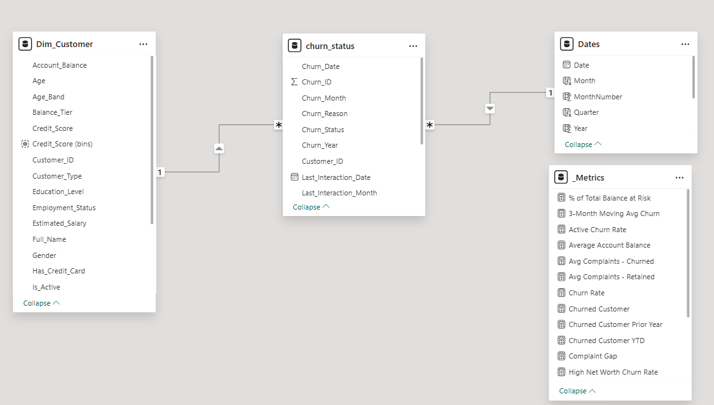

# 🏦 FirstEdge Bank — Customer Churn & Attrition Analysis

An end-to-end Power BI business intelligence solution that analyzes customer churn, financial exposure, and retention risk across a retail banking portfolio. The project transforms customer, financial, and churn datasets into interactive dashboards that help business leaders understand why customers leave and identify data-driven retention strategies.

---

## Table of contents

- [Project Overview](#project-overview)
- [Business Problem](#business-problem)
- [Project Objectives](#project-objectives)
- [Dataset Overview](#dataset-overview)
- [Data Preparation (Power Query)](#data-preparation-power-query)
- [Data Model](#data-model)
- [DAX Measures](#dax-measures)
- [Report Pages](#report-pages)
- [Insights](#insights)
- [Recommendations](#recommendations)
- [Conclusion](#conclusion)
- [Tools Used](#tools-used)

---

## Project Overview

FirstEdge Bank is experiencing elevated customer attrition, creating significant financial and operational challenges across its retail banking portfolio. Customer churn not only reduces long-term customer lifetime value but also increases acquisition costs, weakens customer loyalty, and exposes the bank to substantial revenue risk through lost deposits and reduced product utilization. This analysis was conducted to identify the primary drivers of customer attrition, quantify its business impact, and provide actionable recommendations that support data-driven retention strategies
 >**Research Question:** Which customer segments is FirstEdge Bank losing, why are they leaving, and what actions will have the highest impact on retention?

---

## ❓ Business Problem 
FirstEdge Bank is experiencing a critical customer retention challenge,, with Approximately 51.7% of the bank's retail customer base has churned either closed their accounts or become inactive. This trend directly affects the bank's ability to sustain long-term revenue growth, strengthen customer loyalty, and maximize customer lifetime value. Executive stakeholders-including the Chief Executive Officer, Chief Risk Officer, Head of Retail Banking, and Customer Retention team require a clearer understanding of which customers are most at risk, why they are leaving, and where intervention efforts should be prioritized.
Customer attrition is not a one-time event but a continuous business risk that compounds over time. Although year-over-year churn has declined by approximately 50%, indicating encouraging progress, maintaining and improving this trend requires proactive action. The highest levels of churn are concentrated in the East (55.9%) and North (53.2%) regions, suggesting that regional performance, customer engagement, pricing strategy, and onboarding processes require closer evaluation to prevent further customer losses.
The financial implications are substantial. Approximately ₦3 billion in customer deposits are associated with churned accounts, representing a direct revenue and balance sheet risk. As customer acquisition is considerably more expensive than customer retention, continued attrition particularly among customers within their first two years of banking-threatens the sustainability of the bank's growth strategy and increases the cost of replacing lost customers.
This analysis was undertaken to identify the customer segments most vulnerable to churn, quantify the financial exposure associated with customer attrition, and uncover the key behavioral and operational factors influencing customer departures. Success will be measured by reducing the overall churn rate from 51.7% to below 35% within the next 12 months, decreasing inactivity among customers aged 46–55, increasing product adoption during customers' first two years with the bank, and reducing churn in the East and North regions by at least 10 percentage points.

---

## Project Objectives
The primary objective of this analysis is to provide FirstEdge Bank's executive leadership with actionable insights into the drivers, financial impact, and distribution of customer churn. Specifically, the analysis aims to:
- Quantify the overall level of customer attrition and its impact on revenue exposure. 
- Identify the customer demographics, behaviors, and regions with the highest churn risk. 
- Evaluate the relationship between customer engagement, product ownership, and retention. 
- Determine the primary reasons customers leave the bank and assess their business implications. 
- Provide evidence-based recommendations that support targeted retention strategies and sustainable business growth.

---

## Dataset Overview
The analysis is based on a synthetic retail banking dataset designed to simulate real-world customer churn scenarios.

- **Source:** Synthetically generated using **Mockaroo**.
- **Purpose:** Designed to mirror realistic banking data across customer demographics, financial profiles, and churn behaviour.
- **Records:** 1,000 retail banking customers.
- **Tables:** Three related datasets:
  - `customer_demographics`
  - `account_financial`
  - `churn_status`
- **Analysis Period:** 2022–2024.
- **Data Model:** Star schema with a dedicated Date dimension to support time intelligence and analytical reporting.

> **Note:** The overall churn rate (51.7%) is intentionally elevated beyond typical industry benchmarks (15–25%) to ensure sufficient analytical signal across all customer segments. All findings and methodology apply directionally to a real-world dataset of this structure.

---

## Data Preparation 
The source data was cleaned and transformed in Power Query to improve data quality, ensure consistency, and prepare the model for business analysis.

Key data preparation activities included:
- Handling missing values using mean, median, and mode imputation where appropriate.
- Validating and removing duplicate records across all source tables.
- Standardizing date formats and extracting Year and Month from churn dates for time-based analysis.
- Creating business-focused features, including Balance Tier and Tenure Category, to improve customer segmentation.
- Merging customer demographic and financial datasets into a consolidated Dim_Customer table for star schema modeling.
- Applying appropriate data types to support accurate calculations and efficient report performance.

---

## Data Model
The solution is built on a Star Schema to improve model performance, simplify DAX calculations, and support scalable reporting.

- **Fact Table**
  - `churn_status` – Stores customer churn outcomes, complaint records, satisfaction ratings, and churn dates.

- **Dimension Tables**
  - `Dim_Customer` – Consolidated customer demographic and financial information.
  - `Dates` – Calendar table supporting Year → Quarter → Month analysis.

- **Measures Table**
  - `_Metrics` – Contains 18 DAX measures organized into five display folders.
    ### Star Schema
    
 

  ---

## DAX Measures
A total of 18 DAX measures were created and organized into five display folders to improve model organization, readability, and maintainability.

### 1.  Core Metrics
| Measure Name | DAX Formula | Description / Business Logic |
| :--- | :--- | :--- |
| **Total Customers** | `Total Customers = COUNTROWS('Dim_Customer')` | Calculates the total size of the customer base. |
| **Churned Customers** | `Churned Customers = CALCULATE(COUNTROWS('Dim_Customer'), 'Dim_Customer'[Churn_Status] = "Yes")` | Counts the total number of customers who have officially terminated their relationship. |
| **Churn Rate** | `Churn Rate = DIVIDE([Churned Customers], [Total Customers], 0)` | Computes the percentage of the customer base that has churned, using safe division to handle blank values. |
| **Retention Rate** | `Retention Rate = 1 - [Churn Rate]` | Tracks the percentage of active customers successfully retained by the bank. |
| **Average Account Balance** | `Average Account Balance = AVERAGE('Dim_Customer'[Account_Balance])` | Calculates the mean financial footprint across the customer portfolio. |
| **Total Complaints** | `Total Complaints = SUM('Dim_Customer'[Num_Of_Complaints])` | Aggregates the absolute volume of customer complaints logged. |

---

### 2. Time Intelligence
| Measure | Formula Summary |
|---|---|
| Churned Customer YTD | TOTALYTD(Churned Customer, Dates[Date]) |
| Churned Customer Prior Year | CALCULATE(Churned Customer, SAMEPERIODLASTYEAR) |
| Churned Growth % | DIVIDE(Current - Prior Year, Prior Year) |
| 3-Month Moving Avg Churn | AVERAGEX(DATESINPERIOD, last 3 months) |

---

### 3. Financial Impact

The following financial impact measures quantify the monetary scale of customer attrition, mapping customer behavior directly to the bank's bottom-line exposure:

| Measure Name | DAX Formula | Description / Business Logic |
| :--- | :--- | :--- |
| **Total Balance** | `Total Balance = SUM('Dim_Customer'[Account_Balance])` | Aggregates the total financial deposits across the entire customer portfolio. |
| **Revenue at Risk** | `Revenue at Risk = CALCULATE(SUM('Dim_Customer'[Account_Balance]), 'Dim_Customer'[Churn_Status] = "Yes")` | Quantifies the total active deposit volume lost due to customer churn (currently valued at ₦3bn). |
| **% of Total Balance at Risk** | `[% of Total Balance at Risk] = DIVIDE([Revenue at Risk], [Total Balance], 0)` | Calculates the percentage of the bank's asset base that has been lost to churn, using safe division. |

---

### 4. Operational Risk

The following operational risk measures isolate customer feedback loops to determine whether service failures and complaint volumes correlate directly with customer attrition:

| Measure Name | DAX Formula | Description / Business Logic |
| :--- | :--- | :--- |
| **Avg Complaints — Churned** | `Avg Complaints — Churned = CALCULATE(AVERAGE('Dim_Customer'[Num_Of_Complaints]), 'Dim_Customer'[Churn_Status] = "Yes")` | Computes the average number of complaints logged by customers who ultimately churned. |
| **Avg Complaints — Retained** | `Avg Complaints — Retained = CALCULATE(AVERAGE('Dim_Customer'[Num_Of_Complaints]), 'Dim_Customer'[Churn_Status] = "No")` | Computes the average number of complaints logged by active, retained customers. |
| **Complaint Gap** | `Complaint Gap = [Avg Complaints — Churned] - [Avg Complaints — Retained]` | Measures the absolute difference in complaint volumes between churned and retained cohorts to identify operational friction points. |

---

### 5. Risk Segmentation

The following risk segmentation measures isolate specific behavioral cohorts and asset tiers, allowing the business to pinpoint exactly which customer segments present the highest attrition risk:

| Measure Name | DAX Formula | Description / Business Logic |
| :--- | :--- | :--- |
| **High Net Worth Churn Rate** | `High Net Worth Churn Rate = CALCULATE([Churn Rate], 'Dim_Customer'[Balance_Tier] = "High")` | Isolates the churn rate specifically for premium, high-value deposit holders to track top-tier revenue loss. |
| **Active Churn Rate** | `Active Churn Rate = CALCULATE([Churn Rate], 'Dim_Customer'[Is_Active] = "Yes")` | Evaluates the attrition rate among customers who are frequently engaging with the bank's services. |
| **Inactive Churn Rate** | `Inactive Churn Rate = CALCULATE([Churn Rate], 'Dim_Customer'[Is_Active] = "No")` | Measures the churn rate among dormant accounts, highlighting the conversion rate from low engagement to complete attrition. |

 
